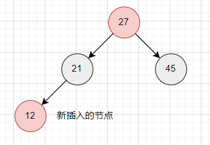
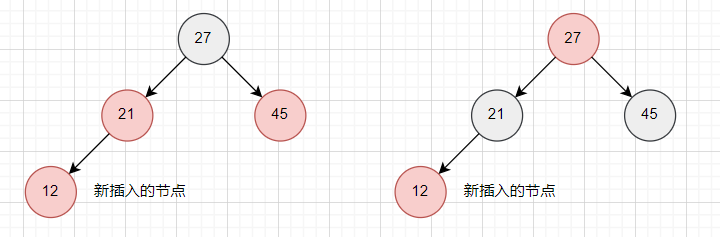
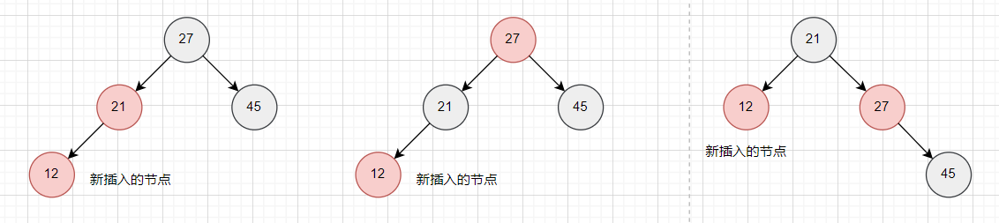
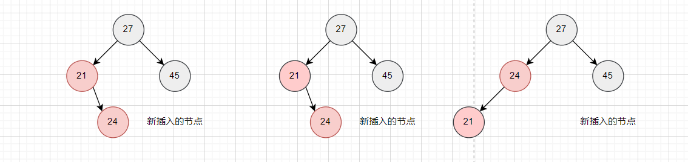
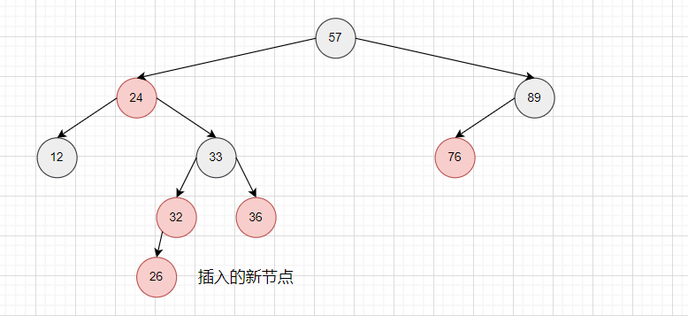
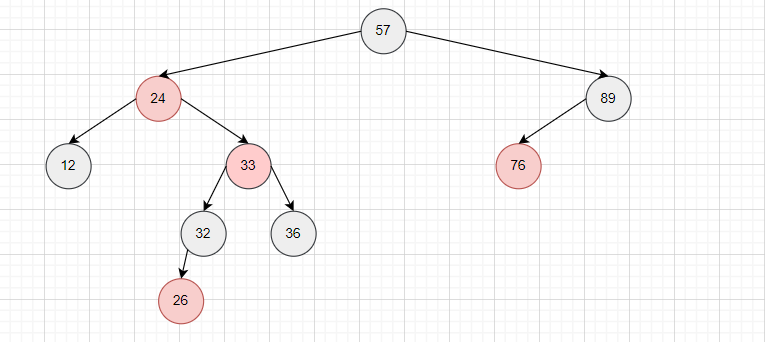
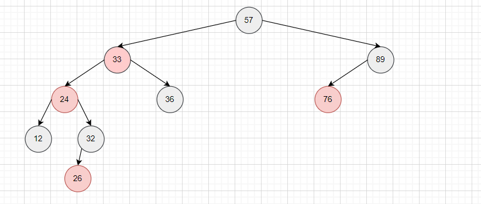
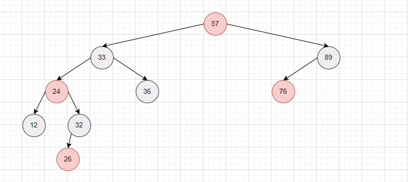
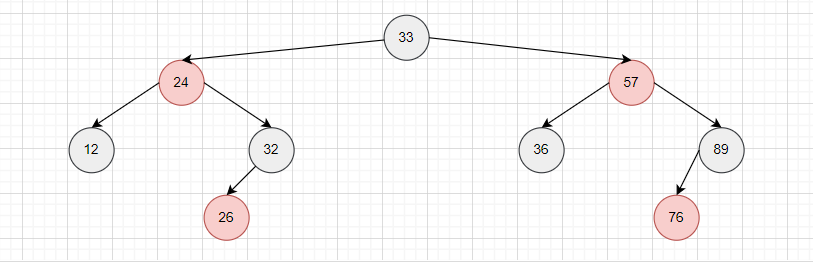

## 红黑树

**1. 红黑树的五个性质**

>1 每一个节点都是有颜色的，不是黑色，就是红色

>2 nullptr是黑色的，即叶子节点的"左右子节点"nullptr是黑色的

>3 root结点必须是黑色的

>4 不能出现连续的红色节点
	
>5 从根节点开始，到任意一个叶子结点的路径上，黑色结点的数量必须是一致的

**2. 红黑树的插入操作**

由于添加一个黑色节点后会破坏性质5，因此默认插入的节点都是红色节点

插入后局部可能出现的四种情况：

- 第一种情况

  

  这并不影响主要的性质4和性质5，因此这种情况不需要改动。

- 第二种情况

  

  出现了两个连续的红色节点，这违背了性质4，因此，需要翻转局部的根节
  点的颜色，以及其对应的左右孩子的颜色，即红变黑，黑变红。

- 第三种情况

  

  出现了两个连续的红色节点，这违背了性质4，但与第二种情况不同的是：局部的右孩子是黑色节点，如果翻转局部根节点及其左孩子，虽然符合了性质4，但**打破了性质5**，因为左图沿左路只有一个黑色结点，但沿右路有两个黑色结点。而翻转后的中间图，两路都只有一个黑色结点了。

  (ps: 这种情况不会出现在叶子节点处，因为在没有插入12这个节点前，左路经过1个黑色结点，右路经过2个黑色结点，这显然不符合性质5，但是可能出现在向上回溯的更新中：比如这里12的位置是第二种情况的局部根结点27，它更新后就变红色节点了。)

  正确的更新方法：翻转局部根节点及其左孩子后，以局部根节点为轴进行右旋转。

- 第四种情况
   

   同上，但是右旋转解决不了问题，需要以局部根节点27的左孩子21进行左旋转，变成第三种情况，然后按第三种情况处理。

 

>一个简单的例子

  

  如图所示，插入一个红色节点的26，此时以33为根的子树中不满足性质4，同时符合第二种情况，于是，翻转33和他的左右孩子32和36。

  

  这样，以33为根结点的左子树就更新完成，但是以57为根结点的子树由不满足性质4，并且符合第四种情况，于是乎，先以57的左孩子24为轴向左旋转，变成第三种情况进行后续处理。

  

  翻转根节点57和左孩子33

  

  最后以57为轴向右旋转，得到更新后的红黑树

  
